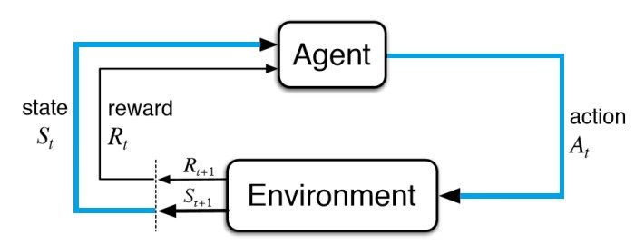

# Processus de décision markoviens (MDPs)

Les processus de décision markoviens (ou MDPs en anglais) constituent les bases-mêmes du **reinforcement learning**.

Comme dit dans l'introduction, le but d'un agent intelligent est de prendre une décision et, si possible, une décision bénéfique pour l'agent, c'est-à-dire une décision rapprochant l'agent de l'objectif spécifié.

## Eléments d'un MDP

Un MDP comprend plusieurs éléments à savoir:
* Un agent
* Un environnement
* Des états (observations de l'environnement)
* Des actions
* Des récompenses

Ainsi, l'agent interagit avec l'environnement dans lequel il se trouve par le biais d'actions qui modifient l'état actuel et engendre une récompense en fonction du nouvel état acquis.

Ce processus de sélection d'une action $a$ à partir d'un état $s$ pour transitionner vers un nouvel état $s'$ en recevant une récompense $r$ survient de manière séquentielle, c'est-à-dire, le processus se répète et retourne un item appelé **trajectoire**.

Une trajectoire est composée de telle sorte : $(s, a, s', r)$

Ainsi, le **but** de l'agent est de maximiser les récompenses cumulatives obtenues de par ses interactions avec l'environnement.

## Notation formelle

Tout ce que l'on vient d'énoncer peut être écrit de manière plus formelle afin d'écrire des formules pour calculer la récompense $r$ pour une action $a$ et un état $s$ à un instant $t$.

Les états forment un ensemble fini d'états noté $S$, de même pour l'ensemble d'actions $A$ et l'ensemble des récompenses $R$.

On dit que pour chaque instant $t$, l'agent reçoit une représentation de l'environnement noté $S_{t} \in S$ et l'agent prendra une action $A_{t} \in A$. On a donc notre couple $(S_{t}, A_{t})$ qui va nous permettre de calculer la récompense pour le prochain état $S_{t+1}$.

Si l'on veut se replacer un instant dans le schéma présenté plus haut:
* L'agent reçoit une représentation de l'environnement ($S_{t}$):

* L'agent prend une action ($A_{t}$) en fonction de $S_{t}$:

La récompense $R_{t}$ n'est calculée que lors du prochain état.

C'est-à-dire $R_t = f(A_{t-1}, S_{t-1})$ ou $R_{t+1} = f(A_{t}, S_{t})$

L'agent reçoit donc la récompense $R_{t+1}$ calculée à partir du couple $(S_{t}, A_{t})$:

Et l'agent entre dans un nouvel état $S_{t+1}$ (i.e. une nouvelle représentation de l'environnement actualisé) dans lequel il aura encore à choisir une action parmi l'ensemble $A$.

Avec tout ceci, vous devriez avoir une bonne base concernant l'intuition derrière les processus de décision markoviens qui construisent les premières pierres de l'édifice du reinforcement learning.

# Comportement de l'agent dans un MDP

On vient de parler plus haut du concept de récompense cumulative. Pour rappel, un agent ne cherchera pas à maximiser la récompense à un instant $t$ mais bien la cumulation de toutes les récompenses.

On introduit alors ici, le concept de **gain** noté $G$, comme étant donc la cumulation de toutes les récompenses.

Ainsi, pour un instant $t$:

$$G = R_t + R_{t+1} + R_{t+2} + R_{t+3} + ... + R_T$$
où $T$ est l'instant correspondant au dernier état.

$G$ est alors un indicateur très important pour l'agent qui se déplace dans l'environnement puisque son but va être de maximiser cette variable. C'est donc en fonction de cette formule qu'il va être amené à prendre certaines actions.

## Episodique vs Continu

On peut différencier deux types de tâches intervenant dans les MDPs.

### Tâches épisodiques

Certaines tâches peuvent se découper en plus petites séquences que l'on appelle **épisodes**. C'est le cas notamment des jeux où chaque partie serait un épisode.

Dans le cas d'une tâche épisodique, le calcul du gain comme présenté précédemment avec un instant final $T$ fait complètement sens puisque l'on a bien une fin dans l'épisode (i.e. fin de la partie).

### Tâches continues

En revanche, certaines tâches ne peuvent pas être découpées en épisodes, on parle de tâches **continues**.

Ces tâches n'ont pas d'état de fin, elles continuent jusqu'à le programme soit stoppé. Par conséquent, on part du principe que $T = \infty$.

Pour prendre un exemple concret, un robot apprenant à marcher tout seul dans un grand environnement physique serait considéré comme une tâche continue.

Alors, qu'arrive-t-il au calcul du gain lorsque l'on fait face à une tâche continue ?

## Facteur de dévaluation $\gamma$

Dans une tâche continue particulèrement, au lieu d'essayer de maximiser le gain, l'agent essaiera pour ce type de tâches, de maximiser la gain dévalué (*discounted return* en anglais).

Afin de définir ce gain dévalué, on introduit $\gamma$ en tant que facteur de dévaluation qui sera compris entre $0$ et $1$.

Ainsi, le gain dévalué est maintenant défini tel que :

$$G = R_t + \gamma^1 R_{t+1} +  \gamma^2 R_{t+2} +  \gamma^2 R_{t+3} + ...$$

$$G = \sum_{k=0}^{\infty}\gamma^k R_{t+k+1}$$

Et voilà ! La formule peut sembler barbare mais lorsque l'on décompose, ce n'est pas si compliqué que ça.

On peut remarquer que cette nouvelle définition du gain va conduire l'agent à se soucier plus des récompenses immédiates que des récompenses qui lui seront données pour des états lointains. Cela est dû au fait que la dévaluation ($\gamma$) est plus importante au fur et à mesure que l'agent parcourt l'environnement.

## Conclusion

* Un processus de décision markovien (MDP) est composé d'un agent, d'un environnement, d'états, d'actions et de récompenses.
* Par le biais de ses actions sur l'environnement et en fonction de l'état dans lequel il se trouve, l'agent obtient des récompenses qui l'aident dans sa prise de décision.
* Pour faire sa décision, un **gain** est calculé sur la base des récompenses que l'agent obtient pour chaque état parcouru à un instant $t$.
* Parfois, la tâche n'est pas épisodique mais continue, donc on introduit un facteur de dévaluation $\gamma$.

## Sources

Ce cours est inspiré de ressources diverses provenant d'Internet.
* https://deeplizard.com/learn/video/my207WNoeyA
* https://fr.wikipedia.org/wiki/Apprentissage_par_renforcement

