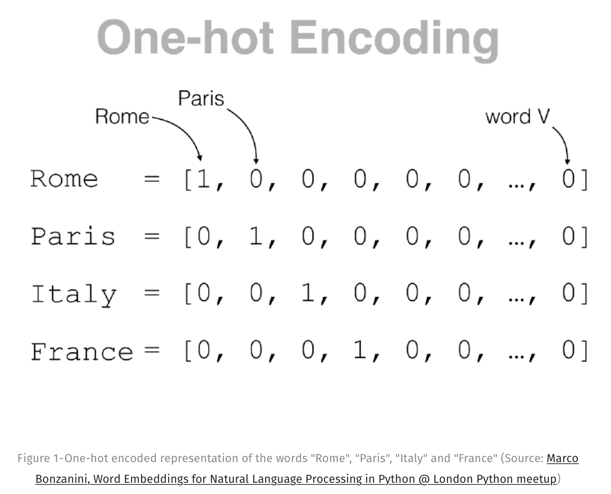

# Embeddings : comment les machines comprennent les mots ?

0. ["Pré-requis"](#prerequis)
1. ["Comprendre" versus "Lire un texte"](#introduction)
2. [Vecteurs de mots](#vecteur2mots)
    1. [Représentation des données](#representdata)
    2. [word2vec](#word2vec)
3. [Embedding & Transfer Learning](#embeddingtlearning)
4. [Cas Pratique - Tuto Code](#pratique)
5. [Embedding hors mots](#embeddingNotword)
    1. [Embedding musicaux](#embeddingMusic)


## "Pré-requis" <a name="prerequis"></a>

Avant de commencer cette section, veillez à bien avoir suivi au préalable le module de Machine Learning (notamment les principes généraux et la partie feature engineering).

## "Comprendre" versus "Lire un texte" <a name="introduction"></a>

Depuis longtemps, les machines sont capables de représenter des caractères, des mots, des phrases de manière numérique. L'idée d'utiliser un système de codage binaire pour le langage et la communication remonte au moins à l'invention du télégraphe au XIXe siècle.

L'une des premières formes de codage des langues était le code Morse. Dans ce système, des signaux binaires, comme l'allumage et l'extinction d'une lumière ou l'envoi d'une séquence d'impulsions audio longues et courtes, étaient utilisés pour représenter différents caractères.

Il s'agissait de l'une des méthodes les plus anciennes et les plus simples pour intégrer le langage humain naturel dans un format binaire avec lequel les machines pouvaient travailler d'une certaine manière.

Depuis, de nombreuses améliorations ont été apportées à notre capacité à coder le texte/langage. Il s'agit notamment des enregistrements audio, des nouveaux algorithmes d'encodage tels que l'ASCII, qui utilise un nombre entier pour représenter le texte, et l'Unicode, qui nous permet d'utiliser les caractères de nombreuses écritures différentes.

Votre disque dur n'aura aucun mal à épeler "defend intelligence" un million de fois avec une précision parfaite. Mais pendant la plus grande partie de leur histoire, les ordinateurs n'ont pas été capables de comprendre que le mot "pomme" peut être à la fois une entreprise technologique dont la capitalisation boursière atteint des milliards de dollars et un fruit rouge ou vert juteux.

Lorsque nous voyons un texte, nous voyons plus que l'information brute qui nous est présentée. Les connaissances que nous avons accumulées au fil du temps donnent un contexte supplémentaire aux choses que nous lisons, ce qui rend le langage et la communication significatifs et efficaces.

Il est normal que les ordinateurs ne puissent pas comprendre le texte pour contruistre des choses intéressantes. 

Plusieurs systèmes de NLP basés sur des approches dites *rules-based* étaient alors jusque là utilisées.
Mais ce type de système basé sur des règles codées en dur est très fragile et ne se généralise pas bien.

Comme nous l'avons déjà mentionné, un ordinateur ne peut pas, à lui seul, déduire le sens d'un mot en regardant simplement le texte. Mais en regardant les mots dans le contexte dans lequel ils apparaissent, les choses s'avère être en sa faveur ...

## Vecteurs de mots <a name="vecteur2mots"></a>

Pour récapituler : nous savons que nous pouvons coder du texte brut avec précision en utilisant des méthodes établies comme l'ASCII et l'Unicode. Cependant, nous avons remarqué que le fait de disposer du texte brut ne suffit pas pour créer des modèles NLP. Nous avons donc besoin d'un moyen d'établir une correspondance avec des chiffres qui codent le sens des mots plutôt que l'information brute.

Nous savons qu'il n'y a pas de méthode parfaite pour y parvenir et cela ressemble beaucoup à la partie sur le feature enginenering dans le cours de Machine Learning. Mais nous espérons que nous pouvons le faire d'une manière qui soit au moins utile pour résoudre les tâches de NLP. 

Nous avons émis l'hypothèse que nous pouvons encoder la signification d'un mot dans une collection de nombres qui décrivent ses différentes propriétés. Ce dont nous avons besoin maintenant, c'est d'un moyen de faire correspondre les mots à leurs propriétés numériques. 

Nous devons également effectuer cette mise en correspondance à l'aide de machines, car il faudrait aux humains un temps incroyablement long pour effectuer cette tâche manuellement.

Pour rendre le problème plus précis, nous dirons que nous voulons stocker toutes ces propriétés numériques de nos mots dans des vecteurs (qui sont simplement des tableaux 1D). La tâche consiste donc à trouver un algorithme qui transforme les mots en vecteurs.

```
Mais attends, c'est quoi la différence entre un tableau et un vecteur ?

Et bien bonne question jeune padawan ! 

Techniquement parlant, les tableaux et les vecteurs ne sont pas la même chose. Les tableaux sont une structure de données qui nous permet d'organiser les données d'une manière particulière.

Les vecteurs, par contre, sont un type spécifique d'objet mathématique abstrait avec une définition précise (un vecteur est un élément d'un espace vectoriel linéaire, et vous pourriez alors définir un espace vectoriel en termes de propriétés de ses éléments).

Si vous voulez vous aventurer dans les profondeurs des mathématiques pures, il est probablement important de garder cela à l'esprit. Mais pour toutes les raisons pratiques qui nous intéressent, les vecteurs et les tableaux 1D sont essentiellement la même chose. Dans ce cours, nous utiliserons ces termes de manière interchangeable.

En fait, le C++ appelle même son tableau à taille dynamique std::vector, et nous avons réussi à construire une grande majorité de l'infrastructure informatique mondiale avec cette nomenclature.
```

Si vous vous souvenez des bases du Machine Learning et en particulier du feature engineeringn (si vous êtes arrivé jusqu'ici, c'est le cas je l'espère sinon n'hésitez pas à retourner sur les cours de bases), vous devez vous souvenir de l'idée de vecteur one-hot.

Un vecteur one-hot est un tableau dont un élément est égal à 1 et tous les autres éléments sont égaux à 0.





Nous utilisons cet encoding car les vecteurs one-hot représentent la manière la plus imple de map les mots vers des vecteurs.

Le n-ième mot dans le dictionnaire aura une représentation one-hot où le n-ième élément est 1 et le reste est égal à 0. Pour le reste de ce cours, nous ferons référence à ce one-hot vector noté $o_{n}$. Supposons que "dfi" est le 1152 mots dans notre dictionaire. Le one-hot vecteur correspondant à "dfi" va être $o_{1152}$ dans notre dictionnaire.

```python
o = torch.zeros(2000)
o[1152] = 1
```

