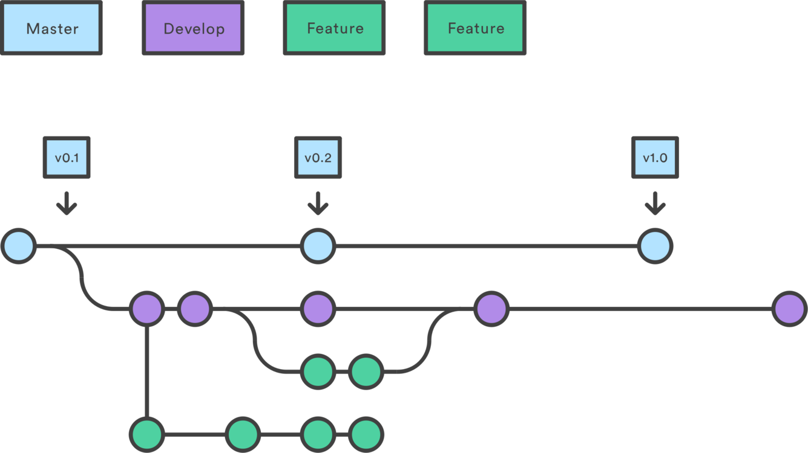

# Version Control 

Ce document est un guide d'utilisation de git pour le projet `ia-z`.

**Git, à quoi ça sert?**

- Permet de sauvegarder votre travail.
- Permet d'avoir des versions parallèles de votre travail.
- Permet de fusionner / merge son travail avec d'autres collaborateurs.
- Permet de sauvegarder l'historique des modifications apportées au projet.

**En pratique, les grandes étapes pour contribuer au projet**

- Cloner le projet : git clone https://github.com/ia-z/ia-z.git
- Créer une issue avec le tag associé à l'équipe/thématique en question : https://github.com/ia-z/ia-z/issues
- Créer une branche en fonction de son équipe : "équipe/feature" (exemple : ML/tradeoffbiaisvariance) directement au sein de son terminal en prenant soin d'être dans le folder du projet : 

```bash
git checkout -b ML/tradeoffbiaisvariance
```

- Après avoir effectué mes modifications, j'ajoute et je commit mes modifications, c'est à dire que je sauvegarde l'état actuel de mon code :

```bash
git add docs/Cours fondamentaux ML/mon_cours_trop_cool_de_ML_surle_tradeoffbiaisvariance.md

git commit -m "feat: ajout de mon cours expliquant l'intérêt des notions X et Y pour le tradeoff biais variance"
```

- Je push vers le remote pour le rendre accessible sur ma branche aux membres de ma team et du projet :

```bash
git push
```

Après avoir push vos modifications au sein de votre branche, il sera nécessaire d'effectuer une pull request (https://github.com/ia-z/ia-z/pulls) pour que votre travail soit pris en compte au sein de la branche master. 

Dès que vous avez push vos modifications sur votre branche, une popup apparait sur le github du projet pour vous proposer de faire une PR. Soyez le plus clair et exhaustif possible sur vos ajouts/modifications. Notamment en prennant soin de mettre en titre de votre PR : #numéro_de_votre_issue 

Votre chap' leader ainsi que les membres du projet pourront effectuer des reviews de votre travail. Dès qu'un accord commun est trouvé, votre chap leader pourra merge votre travail directement sur la branche principale master.

D'accord c'est bien beau tout ça, mais pourquoi je ne peux pas directement merge mon travail sur la branche principale sans déranger personne ?

Celle-ci est protégée et il est nécessaire de respecter ces règles/conventions (qui seront identiques à celles utilisées lors de votre futur job).


**Bonnes pratiques et règles d'utilisation de git**

- Chaque commit de la branche master est un état stable du projet.

[https://www.atlassian.com/fr/git/tutorials/comparing-workflows/gitflow-workflow]

- Chaque chap' leader créera une branche dédiée à son équipe (en violet sur le graph ci-dessus). Une branche sera dédiée pour le ML, NLP, CV, Times Series, Big Data .. afin que les membres de son équipe puissent créer des souss-branches dites de features à partir de celle-ci (en vert sur le graph ci-dessus). Vous comprennez pourquoi il est extrêmement important de respecter la convention de nommage des branches citée précédemment ("nom_équipe" + "feature_associée")  afin de pouvoir s'y retrouver facilement. Les PRs que vous réaliserez seront directement merge sur la branche violet de votre chap' leader après un accord commun au sein de votre équipe. Pour que votre travail soit accepté par l'ensemble de la communauté du projet au sein de la branche master, il sera nécessaire d'avoir l'autorisation de l'ensemble des chap' leader et des personnes en charge de l'harmonisation et du suivi du cours.


- Les commits sur votre sous-branche de feature doivent suivre les règles/conventions suivantes : 

    * Un commit et message de commit par fichier
    * éviter à tout prix le : 
    ```
    git add . 
    ```
    pour ajouter toutes les modifications d'un coup.

    * Les messages de commit doivent suivre une convention précise : 

    ```bash
    git commit -m "fix: votre message"
    git commit -m "feat: votre message"
    git commit -m "BREAKING CHANGE: votre message"
    ```

    ```
    fix: un commit de type fix qui corrige un bug.

    feat: un commit de type feat qui introduit une nouvelle fonctionnalité.

    BREAKING CHANGE: un commit de type BREAKING CHANGE qui introduit une modification qui fait planté votre code.
    ```

    * Soyez au maximum exhaustif pour votre message de commit. Si quelqu'un souhaite reprendre l'historique des modifications, cela lui permettra de mieux comprendre les modifications effectuées.

- Ne pas push sur votre branche un travail non terminé ou non fonctionnel. 

- Au sein de votre pull request, au minimum il faut que :

    * vos modifications soient bien expliquées/documentées.
    * vous ayez respectez l'ensemble des conventions citées jusqu'à présent.
    * vous passez tous les tests/checks liés à la CI (si ce n'est pas le cas, veuillez contacter votre chap' leader).

**Commandes utiles à connaitre**

### Commandes de bases : 

```bash
git status 
```

Permet de déterminer l'état courant de la branche par rapport au dernier commit, donne les fichiers non trackés par git.

```bash
git add 
```

Ajoute un ou plusieurs fichier au tracking. Si vous voulez retirer des fichiers utilisez "git rm". Si vous voulez ajouter tous les fichiers d'un répertoire(à vos risques et périls), utilisez "git add ." ou "git add all"

```bash
git commit
```

Permet de prendre un snapshot de l'état courant de votre codebase (uniquement les fichiers trackés par le git add).

```bash
git push
```

Envoie les commits effectués en local à une remote (repository sur github).

```bash
git pull
```

Récupération des commits d'une remote et merge avec les commits présents localement.

```bash
git branch
```

Donne la branche de développement en cours. En ajoutant l'option -r, vous obtenez l'ensemble des branches du projet.

```bash
git checkout
```

Permet de se placer sur un novueau commit ou une nouvelle branche existante. En utilisant l'option -b suivant d'un nom, vous créez une nouvelle branche avec le nom associé.

### Commandes utiles mais rares d'utilisation pour vos contributions :

```bash
git merge
```

Permet de fusionner deux branches en comparant les commits qui ont été effectués.

## Conclusion

Ce guide te sera utile pour contribuer au projet ia-z. N'hésite pas à t'y référer sans modération pour savoir comment contribuer de manière **propre**, **professionelle** et **efficace** au projet. A très vite sur le discord ou autour d'une pull request ! 

## Sources
* Pour plus d'informations sur la convetion liée aux commits : https://www.conventionalcommits.org/en/v1.0.0/
* https://www.atlassian.com/fr/git/tutorials/comparing-workflows/gitflow-workflow